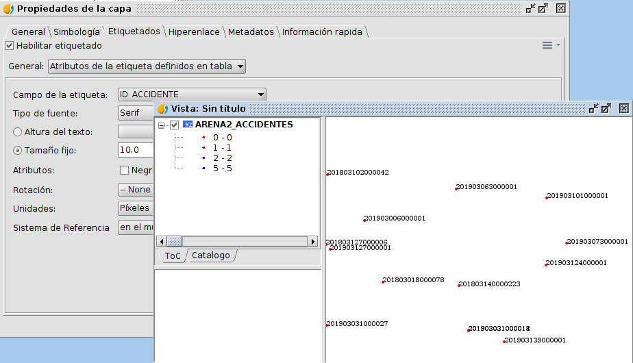

 encoding: utf-8 

 Etiquetado 

El etiquetado es otra de las opciones que se pueden configurar y 
permite que sobre el mapa aparezcan etiquetados los puntos o 
accidentes con la información correspondiente de la que disponen 
en sus datos. Al igual que la leyenda se puede acceder a la configuración del etiquetado mediante las propiedades.

Por ejemplo, sería posible que apareciera junto a los accidentes, 
el valor del campo *ID_ACCIDENTE*.

Si seleccionamos que queremos establecer una etiqueta personalizada, 
está la posibilidad de generar etiquetas en función de una expresión. 
En este caso hemos seleccionado en la opción de *General*, 
*Etiquetas definidas por el usuario*. Elegimos el método, 
*Etiquetar todas las entidades de la misma manera*. En el botón 
*Propiedades* que aparece a la derecha se puede definir el valor 
que tendrá la etiqueta como se puede ver en la imagen.

De esta forma si se acepta y aplica la simbología, sobre la Vista se 
podrá observar  que los puntos de los accidentes aparecen con la 
etiqueta descrita en la expresión anterior, que conforma la unión 
de dos valores *ID_ACCIDENTE* y *KM* del punto kilométrico.

Esto es solo un ejemplo de etiquetados posibles a realizar, las opciones 
pueden ser muchar y muy variadas, incluyendo la personalización de 
las expresiones que pueden ser complicadas, existen otras opciones que 
facilitan la colocación y posición de las etiquetas sobre el mapa para 
una mejor visualización.
