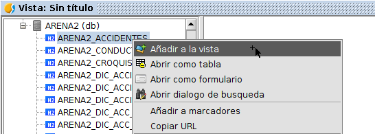
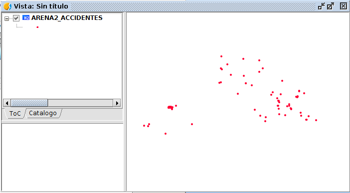

 encoding: utf-8 

 Introduccion 

La tabla de Accidentes tiene un campo con geometría, por tanto, 
esta tabla la podemos añadir a la Vista como una capa. Para 
ello desde el *Catálogo* se puede añadir directamente pulsando botón derecho y pulsando sobre *Añadir a la Vista*.

De esta forma, si vamos a la pestaña de *Tabla de contenidos* o 
*TOC* de la Vista, ya veremos la representación de puntos de 
accidentes sobre el mapa.

GvSIG Desktop dispone de muchas herramientas de procesamiento y 
visualización para datos espaciales. Se va a explicar rápidamente 
dos ejemplos para modificar la representación de la capa en el mapa. 

Los menús principales que se van a explicar aparecen en el menú 
de propiedades. Para acceder sobre la capa que aparece en la 
Vista, presionar con el botón secundario y acceder a la opción 
de *Propiedades*.

En el menú de propiedades aparecerán diferentes pestañas para configurar 
diferentes aspectos de la capa añadida.

