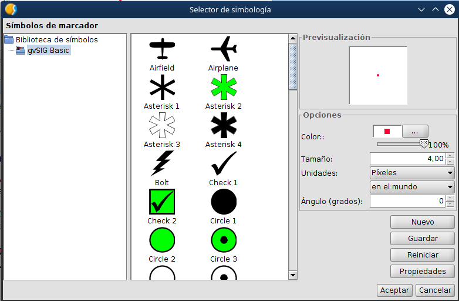

 encoding: utf-8 

 Leyenda 

La leyenda hace referencia a la representación visual que tendrá 
la geometría en la Vista. Se puede modificar la representación 
de diversas formas aplicando diferentes simbologías de diferentes tipos.

Por defecto se aplica una simbología básica de tipo punto

Se puede modificar el grosor o el color del punto, entre otras cosas. 
Para ello hay que entrar en el botón indicado como “Seleccionar símbolo”.

También se podrían seleccionar simbolos preexistentes para la representación 
de los puntos. Si cambiamos los v alores y aceptamos, se podrá ver sobre 
la Vista que la representación de puntos ha cambiado.

Se podría aplicar una leyenda por intervalos, la cual se aplica en 
campos numéricos, y construir una rampa de color con los valores que 
aparecen. En este case se selecciona el campo TOTAL_GRAVES y presionamos 
sobre “Calcular intervalos”.

Se puede comprobar sobre el mapa que se ha aplicado esta representación.

Se podrían añadir otras capas así como servicios externos de datos para 
mostrar los accidentes sobre las carreteras o sobre los terrenos que se 
han producido y sacar mapas con ellos.

