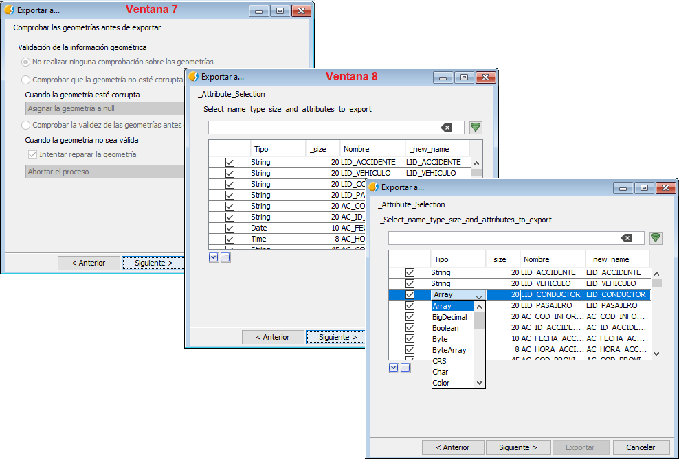

 encoding: utf-8 

 Exportacion a fichero CSV 

Esta nueva funcionalidad permite exportar al formato abierto CSV, 
sencillo para representar datos en forma de tabla, en las que las 
columnas se separan por comas (“ , “) o punto y coma (“ ; “) si la 
coma representa al separador decimal.

La exportación a este formato se inicia definiendo diferentes 
parámetros, ver flujo de imágenes siguiente. En primer lugar 
se selecciona dicho formato como formato de exportación, posteriormente 
en la siguiente ventana se identifica el estándar CSV a utilizar, así 
como el separador entre registros  y el delimitador. En la tercera 
ventana se especifica el nombre del  archivo resultante.

Tras lo anterior, cuarta ventana, se selecciona el tipo de codificación, 
la columna o campo que almacena la geometría si existe, quinta ventana, y 
el tipo de esta, sexta ventana.

Posterior a los pasos anteriores se muestra una ventana con las diferentes 
formas de comprobación de las geometrías antes de finalizar el proceso 
de exportar, ventana siete,. Tras la anterior aparece una nueva ventana, 
ventana número ocho, que permite la selección de las columnas o campos a 
exportar mediante pestañas, ofreciendo la posibilidad de convertir los 
tipos de datos de cada campo durante el proceso de exportación. La última 
imagen de la siguiente composición muestra una pequeña muestra de los diferentes 
tipos de datos a los cuales pueden transformarse los datos originales.

El proceso continúa, novena ventana, definiendo la proyección de los datos en 
el caso de que existan geometrías, dato gráfico. Tras esto se indican los 
los elementos a exportar,  que pueden ser la totalidad de la tabla o aquellos 
que cumplan una determinada consulta gracias a un filtro, ventana número diez. 
La consulta se crea o define al igual que lo indicado en el apartado de 
Ficha de búsqueda avanzada y al igual que esta presenta iconos para la gestión 
de un historial de búsquedas y favoritos que facilitan en gran medida los 
trabajos iterativos. Por último solo queda iniciar el proceso de exportación, 
ventana once.

NOTA IMPORTANTE; Es importante destacar que si la exportación se realiza desde 
una Ficha de búsqueda avanzada el proceso será el mismo pero la ventana 10, 
donde se define la expresión de búsqueda, aparecerá rellena con la expresión 
correspondiente y la pestaña de registros seleccionados marcada.
