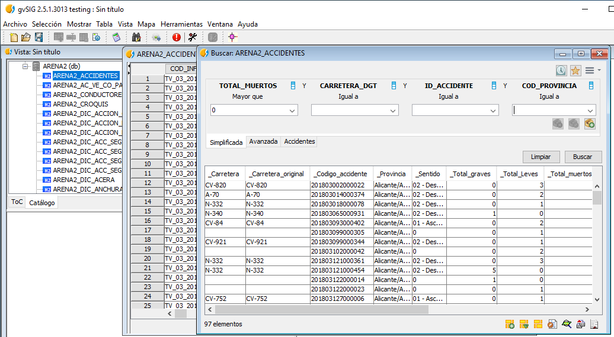
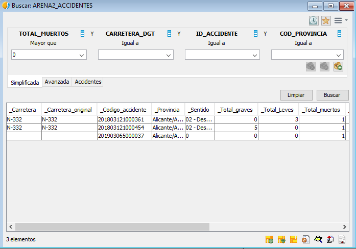

 encoding: utf-8 

 Localizacion de accidentes mortales 

Para realizar este caso se opta por la utilización de la ficha de búsqueda 
simplificada o básica sobre la tabla Arena2_Accidentes por ejemplo, o 
cualquier otra tabla que disponga de esa información.

El primer paso es abrir la citada tabla y tras esto obtener la ficha de 
búsqueda. Tras lo anterior hay que fijar en la zona de selección el campo 
TOTAL_MUERTOS, campo que almacena esa información en esta tabla, en el 
operador lógico se especifica Greater than y en el valor de búsqueda 0 (cero). 
Ver Consulta en la siguiente imagen.

Como resultado de la consulta se muestran los accidentes que cumplen esta 
condición

