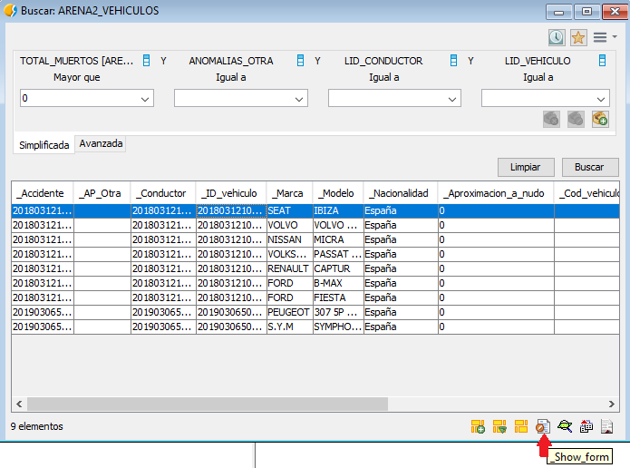

 encoding: utf-8 

 Localizacion vehiculos implicados en accidentes mortales 

Para la localización de vehículos implicados en accidentes mortales vamos a 
utilizar la *ficha de búsqueda simplificada o básica*.

Ya que el objetivo de la consulta es la obtención de vehículos, el primer 
paso será abrir la tabla *ARENA2_VEHICULOS*, la consulta se hará desde esta 
tabla. Una forma de abrir la tabla será desde el *Catálogo*.

Con la tabla abierta se pulsará en *Tabla* y en el icono de *Búsqueda por atributos* que accede a la 
herramienta explicada anteriormente. 

El siguiente paso será indicar el parámetro sobre el que queremos buscar, 
en este caso, buscamos los vehículos implicados en accidentes mortales. 
El campo *TOTAL_MUERTOS* que es el que interesa para la consulta está en la 
tabla de *ACCIDENTES*. Ya que la tabla de *VEHICULOS* y tabla *ACCIDENTES* están 
relacionadas, se pueden crear búsquedas entre ellas.

En la búsqueda simplificada accederemos al icono que aparece al lado del 
campo y aparecerá una ventana la cual muestra todos los campos disponibles en 
la tabla, así como, las relaciones que se tienen con otras tablas. En este 
caso interesa buscar el campo que relaciona ambas tablas que es el llamado 
*ID_ACCIDENTE*. Si presionamos para expandir el campo, se puede observar que 
aparecen los campos de la otra tabla y seleccionamos *TOTAL_MUERTOS* que es el 
que interesa para esta consulta.

Realizaremos la consulta como si fuera el ejemplo anterior, solo que en este 
caso, el resultado será de vehículos. En el campo seleccionado se puede observar 
que indica la relación con la otra tabla y debajo el resultado de vehículos implicados 
en accidentes mortales después de presionar el botón de *Buscar*.

Si presionamos en uno de los accidentes se puede acceder al formulario del vehículo 
para verlo con más detalle.

En el formulario aparecerán todos los valores del vehículo. De la misma forma, 
sobre el formulario del vehículo si presionamos en el campo del *ID_ACCIDENTE*, 
sobre el botón que se muestra en la imagen, se accedería al formulario del 
accidente con el que está relacionado el vehículo. De esta forma se puede 
acceder directamente a la información del accidente en caso de ser necesaria. 
En la imagen se puede observar que el número de fallecidos fue mayor que 0 y 
por tanto, ha hecho correctamente la búsqueda.

