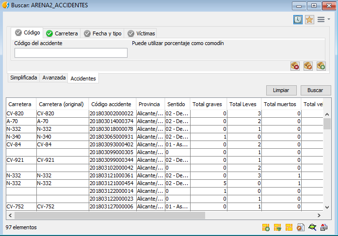
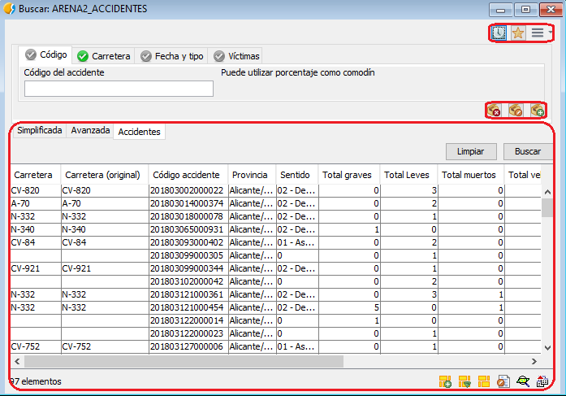
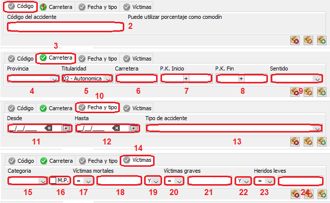

 encoding: utf-8 

La *ficha de búsqueda especifica de accidentes* o *ficha de accidentes* es una herramienta de consulta que aúna los complementos más usuales a la hora de realizar una consulta sobre un accidente.

Su apariencia es muy parecida a las dos fichas de búsqueda anteriores con la excepción de que dichos complementos se muestran en pestañas. Las pestañas que engloban a los complementos para realizar las consultas son:

* Código.
* Carretera.
* Fecha y tipo.
* Víctimas

En la siguiente ilustración se muestran seleccionados los elementos comunes sea cual sea la pestaña seleccionada.

En la siguiente composición de imágenes se muestra los elementos singulares de cada pestaña de complementos.

1. Pestaña que indica que estamos en los complementos de búsqueda relacionados con el *Código*.
2. Barra donde se indica el código del accidente.
3. Pestaña que indica que estamos en los complementos de búsqueda relacionados con la *Carretera*.
4. Desplegable donde se selecciona la provincia donde se sitúa el accidente.
5. Desplegable donde se selecciona la titularidad de la vía.
6. Barra donde se identifica la carretera.
7. Conjunto de pestañas donde se especifica el punto kilométrico de inicio del accidente.
8. Conjunto de pestañas donde se especifica el punto kilométrico final del accidente.
9. Desplegable donde se concreta el sentido del accidente.
10. Pestaña que indica que estamos en los complementos de búsqueda relacionados con la *Fecha y tipo*.
11. Pestaña donde se concreta la fecha de inicio del accidente.
12. Pestaña donde se concreta la fecha de conclusión del accidente.
13. Pestaña que define el tipo de accidente.
14. Pestaña que indica que estamos en los complementos de búsqueda relacionados con las *Víctimas*.
15. Desplegable que indica la categoría del accidente.
16. Pestaña que indica si en el accidente están involucradas mercancías peligrosas.
17. Desplegable con operadores lógicos para obtener información sobre víctimas mortales.
18. Valores a relacionar con el operador lógico anterior.
19. Desplegable con operadores lógicos que permiten concatenar consultas sobre víctimas mortales, víctimas graves y heridos leves.
20. Desplegable con operadores lógicos para obtener información sobre víctimas graves.
21. Valores a relacionar con el operador lógico anterior.
22. Desplegable con operadores lógicos que permiten concatenar consultas sobre víctimas mortales, víctimas graves y heridos leves.
23. Desplegable con operadores lógicos para obtener información sobre heridos leves.
24. Valores a relacionar con el operador lógico anterior.

**NOTA IMPORTANTE;** Las pestañas que indican la temática del complemento, 1, 3, 10 y 14, presentan un icono que se muestra verdes si alguno de sus parámetros define una consulta, parámetros rellenos con valores, y gris si todos sus parámetros se encuentran en blanco o vacios.
