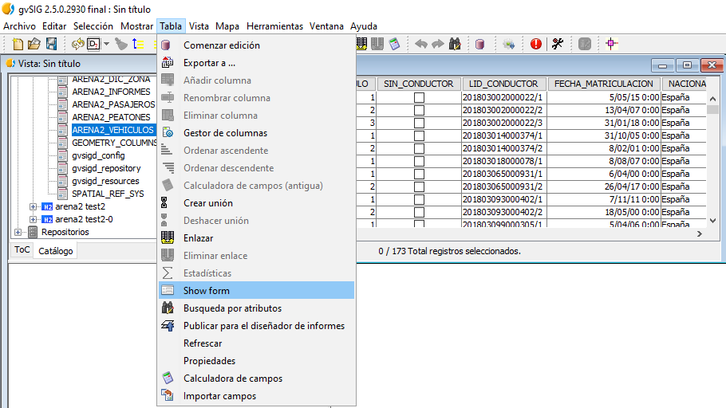
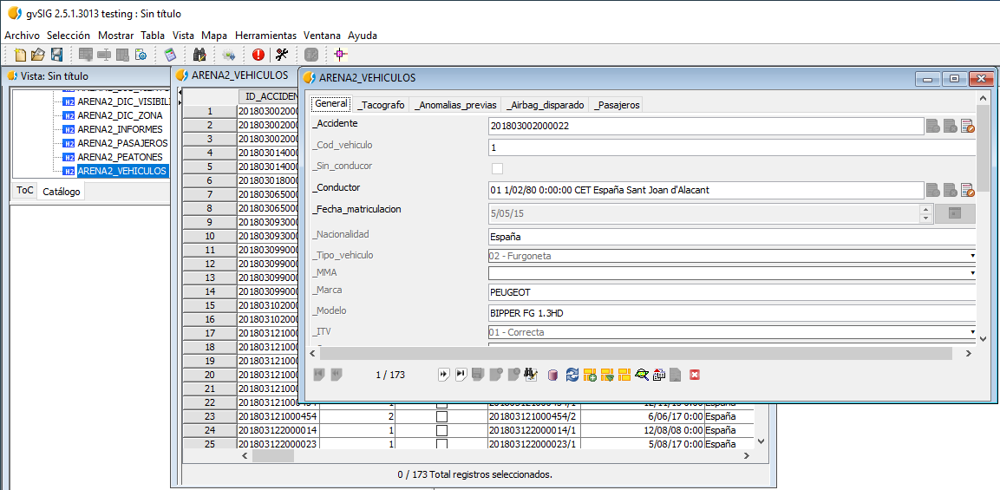
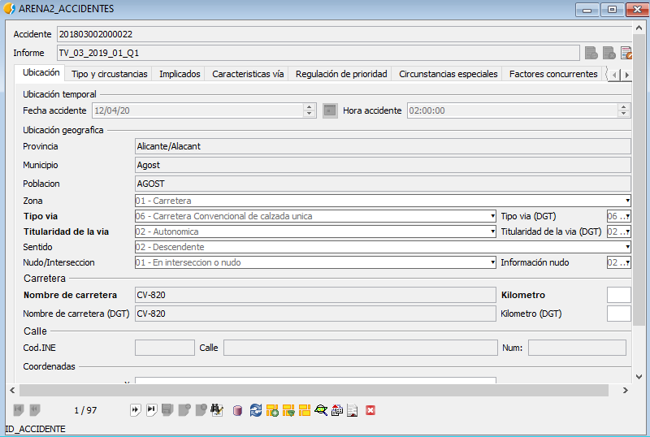
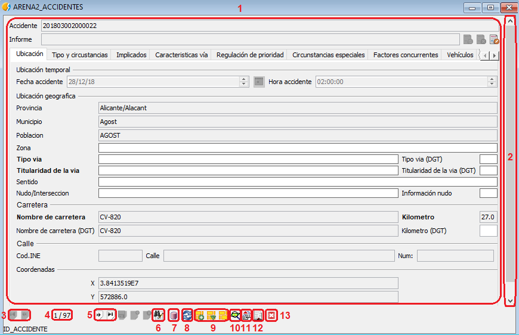

 encoding: utf-8 

 Formularios 

Una vez realizada la conexión a los datos podemos visualizar estos mediante 
el uso de formularios.

Para visualizar la información de una tabla gracias a los formularios esta 
tiene que abierta y es necesario pulsar en el menú *Tabla* la opción *Show form*. 

Una vez ejecutado lo anterior el resultado es el siguiente formulario para 
la tabla en cuestión.

Mencionar que cada tabla puede presentar uno o varios formularios en función 
de las necesidades de visualización, a continuación se muestra el formulario 
para la tabla *ARENA2_ACCIDENTES*.

Aunque sea posible implementar un gran número de formularios, las partes que 
los componen son las mismas y se indican a continuación usando el formulario 
anterior como ejemplo.

1. Área de representación de información. Muestra los campos y la información del registro para cada uno de ellos. Algunos formularios presentan en esta zona diferentes pestañas para agrupar información de la misma naturaleza.
2. Barra de desplazamiento o scroll que permite ver lo diferentes campos del formulario.
3. Iconos que permiten volver al registro anterior o al inicial.
4. El primer número indica el orden de registro dentro de los registros seleccionados para la visualización. El segundo número indica el total de registros a visualizar.
5. Iconos que permiten avanzar al registro siguiente o al final.
6. Icono relacionado de manera directa con la ficha de búsqueda. Básicamente realiza una llamada a la *ficha de búsqueda* en la cual se pueden realizar consultas y la información obtenida se muestra en el formulario. Esta relación anterior es la misma pero de carácter inverso a la proporcionada por el icono   en la *ficha de búsqueda*, que permite llamar a los formularios para la visualización de información ya filtrada.
7. Icono que permite iniciar y terminar edición si se busca realizar cambios de manera directa en los registros.
8. Icono que permite actualizar o refrescar el formulario.
9. Este conjunto de iconos permite la gestión de la selección, con las funciones de añadir a la selección, filtrar la selección y crear una nueva selección respectivamente.
10. Icono que permite realizar zoom al registro en la vista.
11. Icono que permite exportar los registros en diferentes formatos mediante el *Exportador*.
12. Icono que permite mostrar los registros en un informe.
13. Icono de cierre del formulario actual.

**NOTA IMPORTANTE**; Referente al formulario anterior existen campos como son *Tipo de 
vía*, *Titularidad de la vía*, *Nombre de carretera* y *Kilómetro* que aparecen duplicados 
para permitir su modificación si existen errores así como el mantenimiento de la 
información original. 
