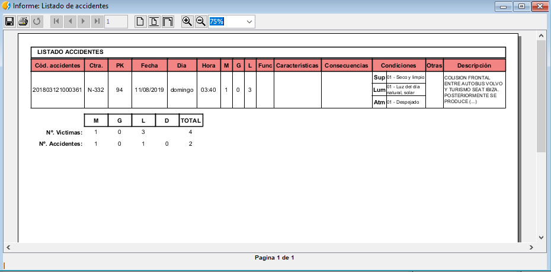

 encoding: utf-8 

 Informes 

Los informes son una forma de visualización más enfocada al documento a papel 
tradicional. Permite visualizar grandes volúmenes de información así como el 
volcado de dichos datos a formato digital y sobretodo a formato físico.

El proceso para la utilización de estos elementos es simple, tras la obtención 
de datos gracias a Fichas de búsqueda o Formularios se puede realizar la presentación 
de esta información en informes específicos pulsando el icono correspondiente
, .

Después de presionar sobre este informe, aparecerá directamente en una ventana dentro 
de gvSIG el informe generado que podrá ser consultado, exportado a PDF o impreso.

O también este otro informe desarrollado para la GVA.

