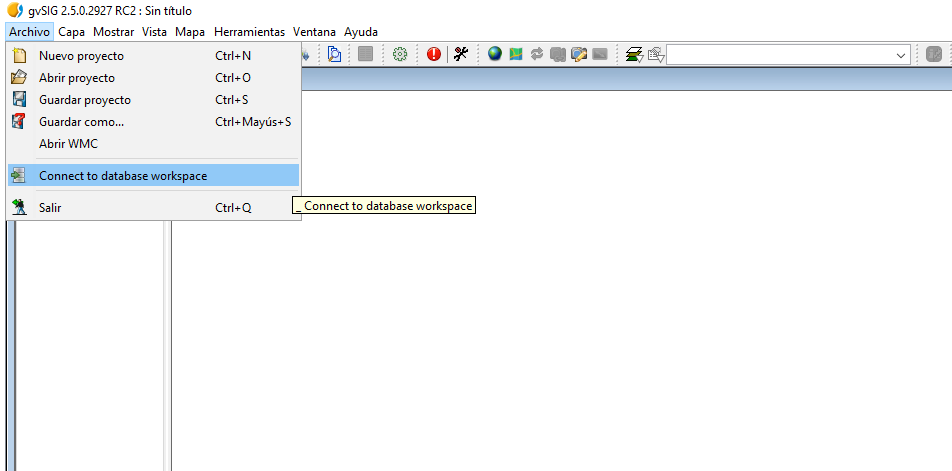
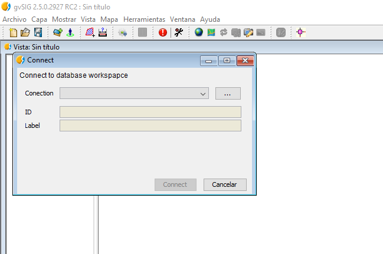
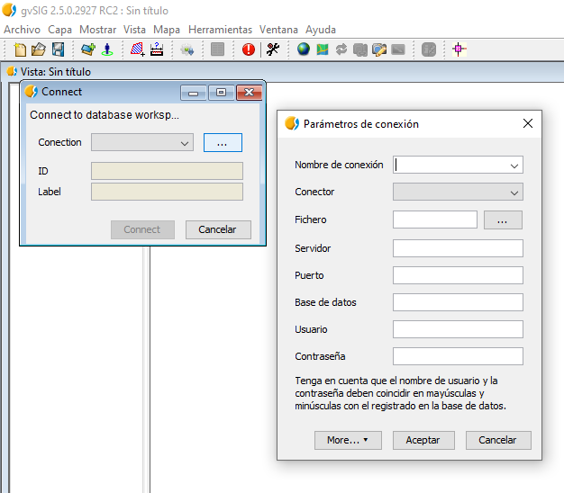
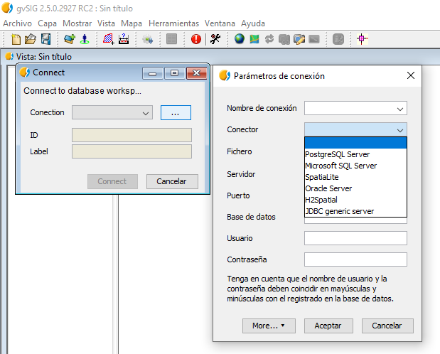
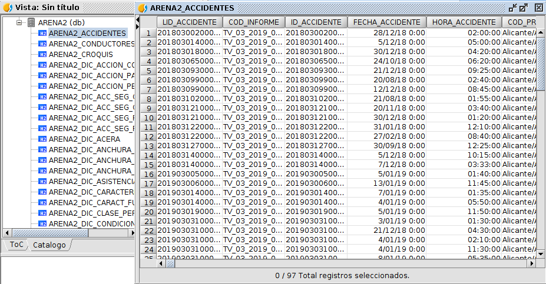
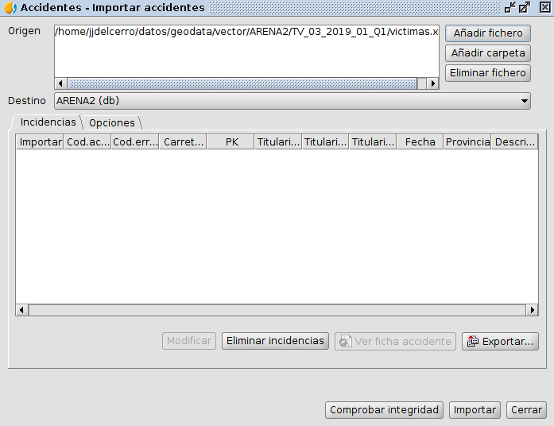
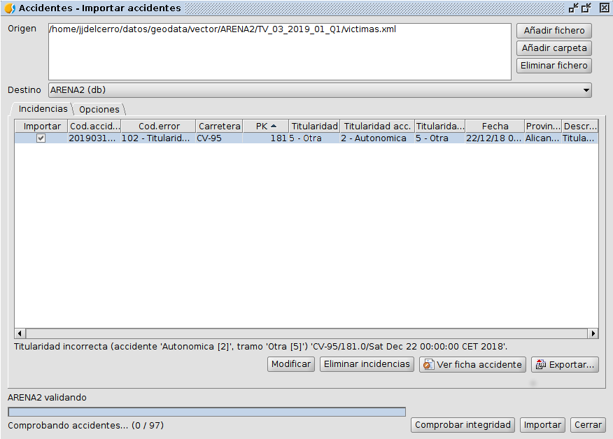
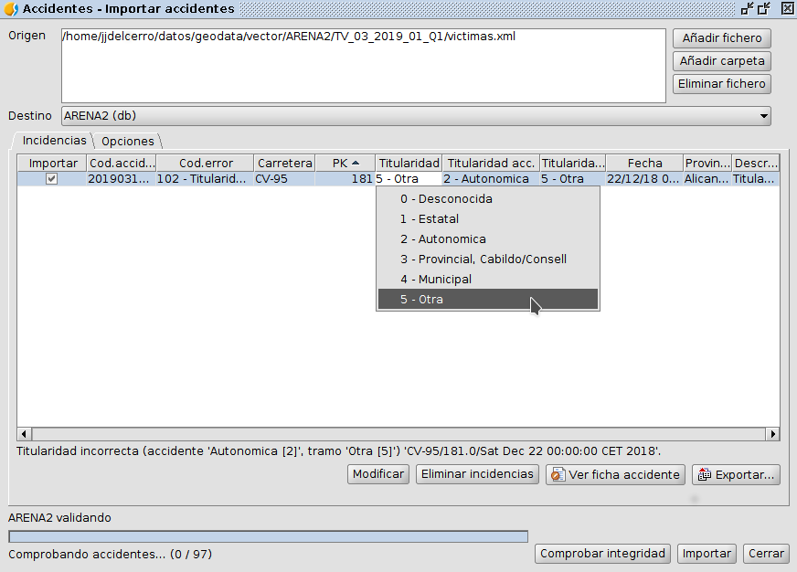
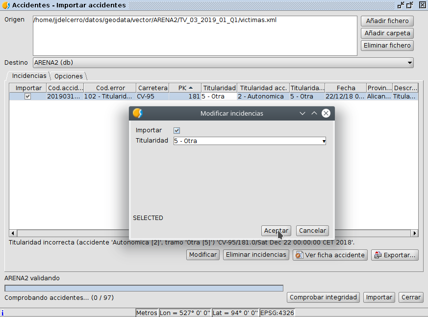

 encoding: utf-8 

# Importacíon de datos de ARENA2

gvSIG Desktop es un software con soporte para cargar los XML de ARENA2, 
proceso que puede realizarse de dos formas. Una primera forma directa o 
más primitiva que nos permite su visualización pero un deficiente tratamiento 
de los datos. La segunda forma resulta más acertada tanto para su visualización 
como para el tratamiento y consiste en cargar la información en un base 
de datos local optimizando la explotación de recursos.

## Creación de tablas

Este es el paso inicial y necesario para trabajar con los datos de Arena2 
y consiste en crear e inicializar las tablas base y diccionarios necesarios 
para poder trabajar con dichos datos.

El proceso comienza al pulsar dentro de la pestaña *Herramientas*, dentro 
de *Arena2*, el comando *Crear tablas*.

Una vez realizado lo anterior se despliega una ventana siguiente.

Dicha ventana permite definir los parámetros de la creación de tablas, de modo 
que todas los checks tienen que estar marcados. Especial mención es que en 
este caso se crea el *Espacio de trabajo*, elemento necesario y definido en 
mayor medida en el apartado de *Conexión a espacio de trabajo*.

La conexión se realiza pulsando el icono de la esquina superior derecha,  y 
rellenando la siguiente ventana emergente que permite especificar todo lo referente 
a la base de datos a conectar y su situación en el equipo.

### Descripción de los datos

Las tablas asociadas a los datos de ARENA2 podemos dividirlas en dos grupos. Por un 
lado las tablas que almacenan los datos de los accidentes propieamente dichos, y por
otro las tablas que definen diccionarios de datos usados por la aplicación.

Las tablas que almancenan los datos de los accidentes son:

* **ARENA2_ACCIDENTES**, Contine la información general de los accidentes.
* **ARENA2_CONDUCTORES**, Contine la información sobre los conductores.
* **ARENA2_CROQUIS**, Contine la la indormacón de los croquis de los accidentes.
* **ARENA2_PASAJEROS**, Contine la información sobre los pasajeros.
* **ARENA2_PEATONES**, Contine la información sobre los peatones.
* **ARENA2_VEHICULOS**, Contine la información sobre los vehículo implicados en los accidentes.

Las tablas de *diccionarios* son las siguientes:

* **ARENA2_DIC_ACC_SEG_CASCO**,Información sobre el uso de casco en un accidente.
* **ARENA2_DIC_ACC_SEG_COND**,Información sobre uso de accesorios de seguridad por el conductor en un accidente.
* **ARENA2_DIC_ACC_SEG_PAS**,Información sobre uso de accesorios de seguridad por los pasajeros en un accidente.
* **ARENA2_DIC_ACC_SEG_PEA**,Información sobre uso de accesorios de seguridad por los peatones en un accidente.
* **ARENA2_DIC_ACCION_CONDUCTOR**,Información sobre las acciones especiales del conductor si las hay.
* **ARENA2_DIC_ACCION_PAS**,Información sobre las acciones especiales de los pasajeros si las hay.
* **ARENA2_DIC_ACCION_PEA**,Información sobre las acciones especiales de los peatones si las hay.
* **ARENA2_DIC_ACERA**,Información sobre la acera en un accidente.
* **ARENA2_DIC_ANCHURA_ARCEN**,Información sobre la anchura del arcén en un accidente.
* **ARENA2_DIC_ANCHURA_CALZADA**,Información sobre la anchura de la calzada en un accidente.
* **ARENA2_DIC_ANCHURA_CARRIL**,Información sobre la anchura del carril en un accidente.
* **ARENA2_DIC_ASISTENCIA_SANITARIA**,Información sobre la asistencia sanitaria dada a cualquier persona implicada en un accidente.
* **ARENA2_DIC_CARACT_FUNCIONAL_VIA**,Información sobre la característica funcional de la vía.
* **ARENA2_DIC_CARACTERISTICAS_PERMISO**,Información sobre el estado del permiso de circulación del conductor en un accidente.
* **ARENA2_DIC_CLASE_PERMISO**,Información sobre el tipo de permiso de circulación del conductor.
* **ARENA2_DIC_CONDICION_FIRME**,Información del estado del firme en un accidente.
* **ARENA2_DIC_DANYOS**,Información sobre el área  más dañada del vehículo.
* **ARENA2_DIC_DESPLAZAMIENTO_PREVISTO**,Información sobre el tipo de desplazamiento previsto antes del accidente.
* **ARENA2_DIC_ERRORES_COND**,Información sobre los presuntos errores cometido por el conductor en el accidente.
* **ARENA2_DIC_ERRORES_PEA**,Información sobre los presuntos errores cometido por los peatones en el accidente.
* **ARENA2_DIC_ESTADO_INFORME**,Información sobre el estado del informe de un accidente.
* **ARENA2_DIC_FACTORES_ATENCION_COND**,Información sobre los factores que puedan afectar a la atención del conductor.
* **ARENA2_DIC_FACTORES_ATENCION_PEA**,Información sobre los factores que puedan afectar a la atención de los peatones.
* **ARENA2_DIC_GENERICO2**,Información genérica (Si/No/Se desconoce).
* **ARENA2_DIC_ILUMINACION**,Información sobre la iluminación en el instante de un accidente.
* **ARENA2_DIC_INFORME_JUDICIAL**,Información sobre la causa del fallecimiento o lesión según informe judicial.
* **ARENA2_DIC_INFRACCIONES_CODUCTOR**,Información sobre presuntas infracciones del conductor en un accidente
* **ARENA2_DIC_INFRACCIONES_OTRAS**,Información sobre otras presuntas infracciones del conductor en un accidente.
* **ARENA2_DIC_INFRACCIONES_PEATON**,Información sobre presuntas infracciones de los peatones en un accidente
* **ARENA2_DIC_INFRACCIONES_VELOCIDAD**,Información sobre presuntas infracciones de velocidad del conductor en un accidente.
* **ARENA2_DIC_ITV**,Información sobre el estado de la ITV del vehículo.
* **ARENA2_DIC_LUGAR_CIRCULA**,Información del lugar por el que circulaba el vehículo.
* **ARENA2_DIC_MARCAS_VIALES**,Información sobre las marcas viales existentes en la zona de un accidente.
* **ARENA2_DIC_METEO**,Información sobre la meteorología en el instante de un accidente.
* **ARENA2_DIC_MMA**,Información sobre la masa máxima autorizada del vehículo.
* **ARENA2_DIC_MOTIVO_DESPLAZA_COND**,Información sobre el motivo de desplazamiento del conductor implicado en un accidente.
* **ARENA2_DIC_MOTIVO_DESPLAZA_PEA**,Información sobre el motivo de desplazamiento del peatón implicado en un accidente.
* **ARENA2_DIC_NIEBLA**,Información sobre el tipo de niebla existente en el momento del accidente.
* **ARENA2_DIC_NIVEL_CIRCULACION**,Información sobre el nivel de circulación existente en el momento de un accidente.
* **ARENA2_DIC_NUDO**,Información que indica si un accidente ha ocurrido en zona de influencia de nudo o intersección.
* **ARENA2_DIC_NUDO_APROX**,Información que indica si el vehículo se encontraba justo, en el nudo o intersección, aproximándose o alejándose del mismo.
* **ARENA2_DIC_NUDO_INFORMACION**,Información a cumplimentar cuando el accidente ha ocurrido en zona de influencia de intersección o nudo.
* **ARENA2_DIC_NUMERO_CALZADAS**,Información sobre el número de calzadas existentes en un accidente.
* **ARENA2_DIC_ONU**,Información sobre el transporte de mercancías peligrosas por parte del vehículo, así como el peligro que representa y la naturaleza de la materia transportada.
* **ARENA2_DIC_POSICION_VEHICULO**,Información de la posición en el vehículo de cualquier persona implicada en un accidente.
* **ARENA2_DIC_POSICION_VIA**,Información de la posición del vehículo en la vía.
* **ARENA2_DIC_PRUEBA_ALCOHOLEMIA**,Información sobre la prueba de alcohol realizada.
* **ARENA2_DIC_PRUEBA_DROGAS**,Información sobre la prueba de drogas realizada.
* **ARENA2_DIC_SENTIDO**,Información sobre el sentido en el que ocurre el accidente, considerando los puntos kilométricos en carretera.
* **ARENA2_DIC_SENTIDO_CIRCULA**,Información sobre el sentido de circulación del vehículo antes de producirse el accidente.
* **ARENA2_DIC_SENTIDOS_VIA**,Información de los sentidos de vía presentes en un accidente
* **ARENA2_DIC_SEXO**,Información sobre el sexo de las personas.
* **ARENA2_DIC_TIPO_ACCIDENTE_ANIMAL**,Información sobre el tipo animal implicado en un accidente.
* **ARENA2_DIC_TIPO_ACCIDENTE_COLISION**,Información sobre el tipo de accidente según primeros indicios.
* **ARENA2_DIC_TIPO_ACCIDENTE_SALIDA**,Información sobre el tipo de salida de vía provocado en un accidente
* **ARENA2_DIC_TIPO_BARRERA**,Información sobre el tipo de barrera existente.
* **ARENA2_DIC_TIPO_VEHICULO**,Información sobre el tipo de vehículo implicado en un accidente.
* **ARENA2_DIC_TIPO_VIA**,Información del tipo de vía donde se ha producido un accidente.
* **ARENA2_DIC_TITULARIDAD_VIA**,Información sobre la titularidad de la vía donde se ha producido un accidente.
* **ARENA2_DIC_TRAZADO_ALZADO**,Información sobre el trazado geométrico vertical de la infraestructura donde se da el accidente.
* **ARENA2_DIC_TRAZADO_PLANTA**,Información sobre el trazado geométrico horizontal de la infraestructura donde se da el accidente.
* **ARENA2_DIC_VEL_GENERICA**,Información sobre si la velocidad de la vía donde tiene lugar el 
  accidente es la velocidad genérica o está indicada por señalización específica.
* **ARENA2_DIC_VIENTO**,Información sobre la existencia de viento fuerte en el momento del accidente.
* **ARENA2_DIC_VISIBILIDAD_RESTRINGIDA_POR**,Información sobre la visibilidad de la zona en el momento de un accidente.
* **ARENA2_DIC_ZONA**,Información que indica si un accidente se ha producido en zona urbana o interurbana.

## Importador de datos

### Conexión a espacio de trabajo

Un espacio de trabajo asociado a una base de datos en gvSIG es un modelo de datos 
para gvSIG Desktop en el que se define las tablas que intervienen, especificando las 
relaciones entre estas y como deben cargarse dichas tablas.

Una idea importante es que estos elementos permiten acceder a las tablas/capas sin 
estar cargadas en el proyecto.

La conexión al espacio de trabajo en gvSIG Desktop se puede realizar de dos maneras;

**Conexión al espacio de trabajo de manera directa.** Para iniciar la conexión al 
espacio de trabajo de manera directa se tiene que ejecutar el comando 
*Connect to database workspace* dentro de la pestaña *Archivo* en la ventana principal.

Tras la ejecución aparece una nueva ventana con celdas vacías que nos permite realizar la conexión.

Para rellenar los campos de dicha ventana se tiene que pulsar el botón con los puntos 
suspensivos *(...)* adyacente a la celda de conexión, apareciendo una nueva ventana que 
permite especificar todo lo referente a la base de datos a conectar y su situación en el equipo.

Especial mención a la pestaña *Conector* que nos permite establecer varios conectores según 
el origen de nuestra base de datos.

Una vez detallada toda la información se pulsa el botón *Aceptar* y se está en disposición de 
iniciar la conexión de manera directa mediante el botón *Connect*.

Una vez realizada la conexión al espacio de trabajo, para comprobar que se ha
realizado la conexión y acceder a los datos disponibles se debe de ir al Catálogo que
aparece en la Vista.

Esta pestaña se encuentra bajo la zona donde se enuncia los diferentes archivos
cargados en el proyecto actual.

Tras pulsar en la pestaña *"Catálogo"* se muestra la siguiente estructura de carpetas.

Accederemos a la opción de *"Repositorios"*, que tras haber realizado correctamente la 
conexión al espacio de trabajo, aparecerá con las conexiones de las que dispone este espacio.

Una vez accedemos a las tablas del repositorio de Arena2, tras pulsar botón derecho sobre 
alguna de ellas se pueden ver las opciones disponibles para estas tablas.

Si por ejemplo presionamos sobre *Abrir como tabla* se podrá visualizar la tabla de
atributos.

### Importador

El Importador es una herramienta que permite a gvSIG Desktop cargar los ficheros
de la base de datos Arena2 en formato XML. Destacar que la información de dichos
archivos no siempre se encuentra en perfecta forma, presentando errores, por
ejemplo, en sus geometrías o en la titularidad. Para corregir lo anterior la Asociación
gvSIG ha desarrollado para la GVA una herramienta que permite mediante
extensiones de geocodificación y reglas de validación de accidentes corregir o
detectar estos errores.

Para visualizar esta herramienta hay que pulsar la pestaña *Herramientas*, dentro de
*Arena2*, el comando *Importador*.

A continuación se muestra la interfaz de este.

Las partes que lo componen son las siguientes.

1. Ventana con la ruta y archivo a añadir.
2. Icono que permite añadir ficheros.
3. Icono que permite añadir una carpeta contenedora de ficheros.
4. Icono que permite eliminar o suprimir un fichero de los añadidos en la ventana.
5. Desplegable donde se identifica la base de datos donde se van a integrar los ficheros.
6. Ventana con dos pestañas. La pestaña *Incidencias* muestra los casos donde el proceso indique 
   una falta de integridad, mientras que la pestaña *Opciones* muestra si la herramienta de 
   geocodificación está activa, así como otras reglas de validación.
7. Icono que permite modificar por ventana una determinada caracterástica de un número de muestras.
8. Icono que permite eliminar las incidencias.
9. Icono que permite exportar las incidencias en diferentes archivos gracias al *Exportador*.
10. Icono que inicia el proceso de geocodificación y utilización de las reglas de validación para 
    comprobar la integridad de los datos. Si un dato presenta algún error este se muestra en la 
    ventana número 6.
11. Icono que importa los datos.
12. Icono que cierra el *Importador*.

Una vez seleccionados los ficheros se puede proceder al proceso de importación.

La herramienta tiene la posibilidad de registrar extensiones las cuales realizarán
validaciones o transformaciones de los datos durante el proceso de importación. En
este caso las extensiones se han personalizado para la GVA, pero se pueden
desarrollar otras extensiones que se adapten a otra tipología de datos o que tenga
otras necesidades de validación.

Las extensiones desarrolladas para la GVA son tres, una para el procesamiento de
los datos y dos para la validación de integridad. En el menú de opciones se pueden
comprobar las extensiones registradas y activar o desactivar las que se deseen
utilizar en este momento.

* La geocodificación. Permite geocodificar en base a segmentación dinámica sobre la base de 
  datos de carreteras de la GVA.
* Dos reglas de validación.
  
  1. Regla de validación que comprueba si la titularidad de la carretera donde se produce 
     el accidente coincide con la titularidad de dicha carretera  en la base de datos de 
     carreteras de la GVA.
  2. Regla de validación que comprueba la existencia de conflicto en los 
     campos *Tipo de vía*, *Titularidad de la vía*, *Nombre de la carretera* y *Kilómetro* 
     entre lo especificado por la DGT y la base de datos de carreteras de la GVA. Si hay 
     conflicto el importador permite su modificación.

El primer paso sería realizar una comprobación de integridad. Esta comprobación
lanzaría las reglas de validación y las incidencias encontradas aparecerían en el
panel. En el caso de no tener reglas de validación registradas, la Comprobación de
Integridad no hará ninguna función.

#### Gestión de incidencias y exportación

Una vez producida una incidencia esta puede tratarse de dos maneras.

* Ajustar el campo mediante la pestaña de manera directa pestaña de manera directa.
* Utilizando el botón *Modificar*.

A continuación se muestra un ejemplo de cómo realizar el cambio en la pestaña de
manera directa en el campo *Titularidad*.

Tal y como se aprecia en la imagen anterior aparece una ventana desplegable con
las opciones disponibles para dicho campo. Esta opción es útil si el número de
incidencias es reducido puesto que la modificación se realiza caso a caso.

La otra opción de cambio se realiza al pulsar el botón *Modificar*, el cual crea una
ventana emergente. Ver imagen siguiente.

En dicha ventana emergente aparece el campo, en este caso *Titularidad*, y un
desplegable con las diferentes opciones de igual manera que en el caso anterior,
pero como diferencia, la modificación mediante esta forma permite realizar cambios
a multitud de casos. Este proceso se realiza seleccionando dichos casos o el campo
concreto y pulsando dicho icono.

Otro aspecto destacable en este apartado es la exportación de las incidencias. Para
realizar dicha exportación estas tiene que estar marcadas en la pestaña *Importar*
dentro del cuadro de incidencias y se tiene que pulsar el botón *Exportar*. Tras
realizar lo anterior se ejecuta el *Exportador* que permite realizar ese proceso en
multitud de formatos.

Una vez completada la gestión de incidencias, se podría pasar a la importación de
datos. Durante esta importación se ejecutarían las extensiones de transformación en
el caso de disponer de ellas.
