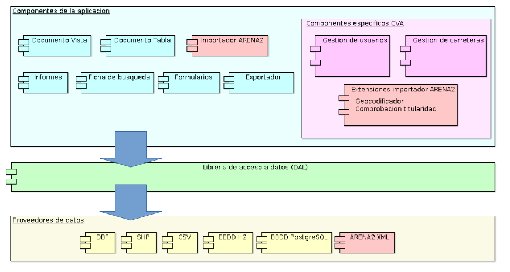

 encoding: utf-8 

# Solución adoptada

La solución adoptada en el software gvSIG permite realizar estudios de 
accidentalidad tal y como se menciona en el párrafo anterior y lo realiza 
mediante la implementación de 3 grandes grupos de procesos.

**Importación de datos de Arena2.** Este apartado permite la obtención de la 
información mediante el diseño de un módulo de base de datos acorde a las 
especificaciones del sistema Arena2, la cual almacena los datos proporcionados 
gracias a la creación de un importador de datos extensible que permite a parte 
también la gestión de incidencias.

**Consulta de accidentes (consulta de datos).** Como su propio nombre indica este 
apartado permite la visualización de los datos mediante fichas de búsqueda o 
formularios, los cuales nos proporciona un conjunto de registros o un único 
registro respectivamente. Además este apartado proporciona también la posibilidad 
de visualizar los datos en informes así como exportarlos en diferentes formatos 
como por ejemplo CSV.

**Añadir a la vista.** Esta última fase de la herramienta no deja de ser otra forma 
de visualización pero se enfoca más en el aspecto geográfico del dato. Con esta 
nueva funcionalidad se pueden crear diferentes mapas con sus respectivas leyendas 
y etiquetado que permitan un estudio de manera visual de la información.

## Situación previa

Previo a la realización de los trabajos que dan soporte al formato XML de ARENA2, 
existían para gvSIG Desktop complementos utilizados para la gestión de carreteras, 
accidentes y aforos. Estos complementos estaban desarrollados específicamente para 
ser usados en el entorno de la GVA, ya que dependían de BBDD con estructuras específicas 
ubicadas en las instalaciones de esta. Los complementos existentes eran los siguientes:

* Gestión de usuarios (org.gvsig.cegesev.roadadmin)
* Gestión de carreteras (org.gvsig.cegesev.roadcatalog)
* Gestión de accidentes (org.gvsig.cegesev.accidentrate)
* Gestión de aforos (org.gvsig.cegesev.capacity)

## Modificaciones solicitadas

Debido al cambio en el formato en como la DGT proporciona a la GVA la información de 
los accidentes, se solicita dar soporte a que el complemento de *"Gestión de accidentes"*
sea capaz de importar los nuevos ficheros.

## Solución implementada

Tras evaluar el impacto en el complemento de *"Gestión de accidentes"* se decide sobrescribir
completamente el complemento, optando por un modelo que reduzca al mínimo los desarrollos 
específicos e incluya de base en la aplicación "gvSIG Desktop" gran parte de la funcionalidad 
que tenia el complementos de *"Gestión de accidentes"* existente. Para esto el desarrollo se 
divide en cuatro bloques:

* Actualizaciones en el núcleo de gvSIG Desktop (mejoras o nuevos desarrollos 
  relacionados con Informes, fichas de búsqueda, formularios, exportador,...).
* Desarrollo de un proveedor de datos para XML ARENA2.
* Desarrollo de un importador de datos extensible de ARENA2 a BBDD.
* Desarrollo de extensiones específicas de la GVA para el importador de datos.

En el siguiente gráfico de bloques podemos observar en que parte de la aplicación encajan cada 
uno de estos desarrollos.

Los desarrollos coloreados en rojo, son los desarrollos específicos realizados para la GVA.

Los nuevos desarrollos, aunque pueden funcionar de forma independiente de los desarrollos que 
ya existían previamente, mantienen una relación, que no dependencia, con el complemento de 
gestión de usuarios. Esto es, si esta instalado el complemento de gestión de usuarios, 
lo utilizara para comprobar si el usuario tiene permisos para realizar algunas operaciones, 
como pueden ser:

* Modificación de la fecha de cierre.
* Modificación de los datos de titularidad de un accidente.

De forma que solo los usuarios con permisos podrán realizar estas operaciones.

Si no esta instalado el complemento de gestión de usuario, se podrá utilizar la aplicación 
y acceder a los datos para su explotación, pero no se podrán modificar los accidentes 
importados en la BBDD. 

Siempre que el usuario tenga las credenciales de acceso a la BBDD adecuadas no precisara 
de la herramienta de gestión de usuario para realizar operaciones de explotación de los datos.

Vamos a ver con un poco de detalle en que consisten los cuatro bloques comentados.

### Actualizaciones en el núcleo de gvSIG Desktop

Se trata de una serie de mejoras destinadas a aportar a gvSIG Desktop la funcionalidad 
que incluía el complemento de "Gestión de accidentes" de forma que estas estén disponibles
en la base de la aplicación. Las principales son:

* Creación de una ficha de búsqueda. Se añade una nueva ficha de búsqueda en 
  la que se pueda especificar una condición de búsqueda y se presente los 
  resultados en forma de tabla.
  
  La ficha de búsqueda dispone de un modo de búsqueda simple y otro avanzada. 
  Dispone de las siguientes funcionalidades:
  
  * Favoritos e histórico de búsquedas
  * Campos de búsqueda preferidos
  * Campos de búsqueda mas usados
  * Búsqueda en tablas relacionadas
  * Enlace a tablas con lista de valores
  * Previsualización de valores asociados a un campo
  * Formulario asociado a los datos
  * Exportación resultados de búsqueda
  * Informes sobre los resultados de búsqueda

* Mejoras en el exportador de gvSIG. Se añade la funcionalidad relacionada con:

  * Exportación a CSV
  * Selección de campos a exportar y posibilidad de cambiar el nombre de estos.
  * Favoritos e histórico de exportaciones

* Mejoras en la gestión de formularios.
* Mejoras en los informes, entre otras se añade la posibilidad de asociar 
  informes a una tabla o capa.

### Nuevo proveedor de datos para XML ARENA2

La aplicación "gvSIG Desktop" dispone de una capa de abstracción para acceso 
a los datos. Esta capa de abstracción expone el concepto de "almacén de datos",
ofreciendo una serie de funcionalidades hacia la aplicación independientes del 
formato de datos al que se quiere acceder (como puede ser, la obtención de 
"cursores", su recorrido, filtros sobre ellos, localización de registro, ...). 
En las partes de la aplicación que precisan acceder a los datos, se utiliza esta 
capa de abstracción, de forma que el desarrollo de la funcionalidad no esta ligado 
a un formato de datos especifico. 

Así mismo la capa de abstracción define el concepto de proveedor de datos, y a 
que operaciones debe responder este, de forma que existe un proveedor de datos 
para cada formato especifico que soporta la aplicación. Por ejemplo, existe un 
proveedor de datos para acceder a ficheros CSV, otro para DBFs, otro para SHPs, 
otro para BBDD PostgreSQL o para BBDD H2 Spatial. Este modelo permite desacoplar 
los entresijos del formato, de la lógica de la aplicación, de forma que una 
actualización en el formato implica la modificación del proveedor de datos, 
reduciendo al mínimo la adaptación o modificación del resto de la aplicación a 
los cambios en este.

Además, el modelo de proveedores de datos de gvSIG Desktop, no es un modelo 
estático. No existen 3 o 5 proveedores de datos. Estos se pueden cargar 
dinámicamente en el arranque de la aplicación. El núcleo de gvSIG Desktop 
lleva con sigo los proveedores de:

* Ficheros CSV.
* Fichero dBASE (DBFs)
* Ficheros Shape (SHPs)
* Bases de datos H2 Spatial.

Luego existen una serie de complementos que aportan otros proveedores de datos y 
que no forman parte del núcleo de gvSIG Desktop aportando soporte para:

* Bases de datos PostgreSQL/PostGIS
* Ficheros DXFs
* Fichero DWG
* Fichero MS Excel (XSL)
* Fichero ODS
* Bases de datos Oracle
* Bases de datos MS SQLServer

Y algunos más además de los propios para acceder a datos raster que tienen su 
propio modelo de datos distinto del de los datos tabulares y vectoriales.

Algunos proveedores están desarrollados en Java, pero existen también 
proveedores desarrollados a través de la herramienta de scripting en 
Python. El uso de estos por parte de la capa de abstracción de datos 
es independiente del entorno o lenguaje usado para su desarrollo 
siempre que el proveedor cumpla con las especificaciones de la capa de 
abstracción.

Con este concepto en mente, lo que se se ha hecho es desarrollar un proveedor 
de datos, utilizando la herramienta de scripting, que sea capaz de leer un 
fichero XML ARENA2, de forma que la aplicación pueda acceder a los datos de 
este como si de cualquier otro "almacén de datos" de gvSIG Desktop se tratase. 
Este proveedor de datos se despliega en la aplicación en forma de un complemento 
independiente, de forma similar a como lo hace el de BBDD postgreSQL, DXF o ODS.

Dado que el proveedor de datos de XML ARENA2, se trata de un proveedor muy 
especifico, es decir, no lee datos de cualquier XML, sino solo de los datos de 
ARENA2, que define un modelo de datos en concreto, no solo esta en condiciones 
de aportar cómo acceder a los datos, si no también otro tipo de información como:

* Etiquetas y descripciones para los campos.
* Relaciones entra las distintas tablas que hay en el fichero XML.
* Personalización de los formularios asociados a las distintas tablas del modelo de ARENA2.
* Personalización de los informes asociados a las tablas del modelo de ARENA2.
* Diccionarios de datos específicos del modelo de ARENA2.

Con lo que se trata de un proveedor de datos que ademas de los datos aporta mucha 
información sobre como se deben visualizar estos.

### Importador de datos de ARENA2 a BBDD

Aunque la existencia de un proveedor de datos de XML ARENA2 para gvSIG Desktop 
permite ya la carga de los fichero XML de ARENA2 en la aplicación, la funcionalidad 
que tenemos con esto es limitada. Por ejemplo, los datos del XML se cargan en memoria. 
O solo podemos acceder a los datos de un fichero XML a la vez. No se dispone de 
indices que permitan optimizar el acceso a los datos. 

¿ Esto que quiere decir ? Pues que si tenemos dos ficheros XML de dos quincenas de 
datos de accidentes, no podríamos cargarlos y realizar una búsqueda que arrojase datos 
de las dos quincenas ya que cada quincena estaría en una tabla separada. Ademas, 
aunque pudiésemos unir en un solo XML los datos, estos se cargan en memoria para acceder 
a ellos, con lo que no podríamos cargar ficheros muy grandes. Y cuando quisiésemos realizar 
una búsqueda sobre ellos, esta seria secuencial, es decir, tendrá que recorrerse todos 
los datos para localizar los que cumpliesen el criterio indicado.

Así que, aunque parezca atractivo trabajar directamente con los ficheros XML, no 
es optimo, y por ello se opto por implementar un importador de estos sobre una BBDD. 
Se desarrolló un importador específico para ese tipo de fichero ya que debería realizar 
algunas tareas específicas. Se precisaba poder realizar:

* Una georeferenciación de los accidentes en función de la carretera y el pk.
* Realizar comprobaciones sobre la titularidad de la carretera.
* Realizar comprobaciones sobre si una actualización de un accidente entraba 
  en conflicto con modificaciones hechas en los datos de "nuestra" BBDD.

Y en función de las comprobaciones realizadas sobre los datos de los accidentes, 
poder realizar una gestión de las incidencias producidas.

Para su desarrollo se decidió preparar un importador sobre el que se pudiesen registrar 
"reglas de comprobación" y "transformaciones de datos", y este se encargase de invocar 
a las reglas y transformaciones sobre los datos de entrada, realizar la gestión de 
incidencias e importar los datos en la BBDD de destino.

Se dejo fuera del importador la implementación de las reglas y transformaciones, de 
forma que cada organismo que lo precisase pudiese aportar las suyas. Se trata pues 
de un importador "genérico" que se puede usar para cargar los datos de los XML de 
ARENA2 en una BBDD para luego poder realizar tareas de explotación sobre el conjunto 
de datos y no sobre XML independientes.

### Extensiones específicas de la GVA para el importador de datos.

Debido a las necesidades de la GVA, importar los datos de los XML en bruto no era 
suficiente. Al menos había dos operaciones que había que realizar con los datos 
antes de cargarlos en la BBDD, y que ademas, eran dependientes de información que 
tenia la GVA en otras tablas de BBDD propias.

Esto llevo al desarrollo de reglas de comprobación y transformaciones específicas 
para la GVA a la hora de importar los datos, que se aportan en un complemento 
independiente del importador. Este complemento aporta, entre otras cosas:

* Una transformación, que añade a los datos del XML información de 
  la posición del accidente sobre una carretera a partir de la identificación 
  de la carretera y el punto kilométrico en el que se produce el accidente. 
  Para esto se usa la base de datos de carreteras de la GVA, aportando una 
  precisión mucho mayor que la que viene en los datos del accidente, ya que en 
  este no siempre se dispone de esa información y en bastantes ocasiones, 
  aunque se disponga no es precisa o fiable.
* Comprobación de titularidad de la carretera. Se trata de comprobar si la 
  titularidad de la carretera que figura en el accidente coincide con la que 
  tiene la GVA en su BBDD de carreteras, generando la correspondiente incidencia 
  en caso de ser necesario.
* Comprobación de conflictos. En ocasiones, la GVA precisa alterar los datos de 
  la carretera, kilómetro o titularidad que figuran en el accidente. Esta regla 
  se encarga de comprobar si llega una actualización de un accidente que entra en 
  conflicto con las modificaciones que ha realizado la GVA en estos datos.
  