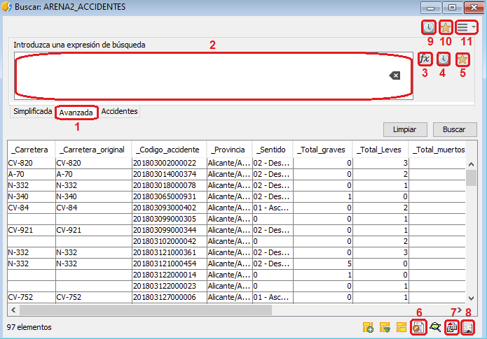

 encoding: utf-8 

 Avanzada 

La ficha de búsqueda avanzada resulta una mejora de la básica ya que permite realizar consultas más complejas gracias a la implementación del *Creador de Expresiones* o *Expression Builder*. Este constructor de expresiones permite un mayor grado de libertad a la hora de construir consultas, permitiendo un mayor nivel de detalle en las búsquedas.
Además la ficha de búsqueda avanzada permite también la gestión de un historial de búsquedas y favoritos que facilitan en gran medida los trabajos iterativos.
Las partes que componen a la ficha de búsqueda avanzada son las siguientes.

1. Pestaña que indica que la ficha de búsqueda es la avanzada.
2. Cuadro de texto donde se indica la expresión para la consulta.
3. Icono que realiza la llamada al creador de expresiones o Expression Builder.
4. Icono que muestra el historial de expresiones.
5. Icono que muestra las expresiones favoritas.
6. Icono que permite mostrar la búsqueda en un formulario.
7. Icono que permite exportar la búsqueda en diferentes formatos mediante el *Exportador*.
8. Icono que permite mostrar el resultado de la búsqueda en un informe.
9. Icono que muestra el historial global de cualquiera ficha de búsqueda sea cual sea.
10. Icono que muestra las búsquedas favoritas de cualquiera ficha de búsqueda sea cual sea.
11. Icono que permite seleccionar herramientas extra dentro de la *ficha de búsqueda*. Son las mismas que las expuestas en el apartado de la *ficha de búsqueda simple*.

El *Creador de Expresiones* presenta la siguiente forma y se trata en profundidad así como las diferentes expresiones que permite utilizar en el apartado *Creador de expresiones* en *ANEXOS*.

