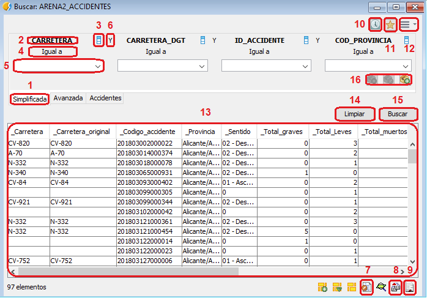
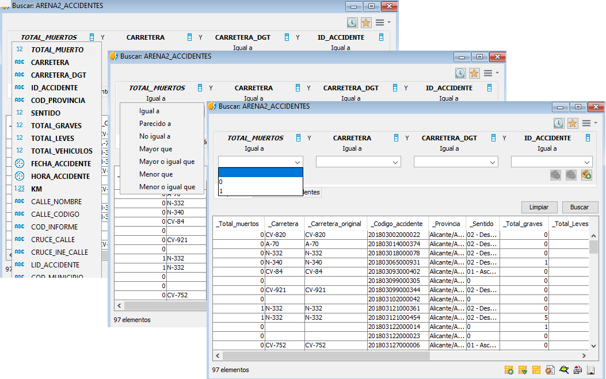

 encoding: utf-8 

 Búsqueda simplificada 

La ficha de búsqueda simplificada o básica es la que aparece 
por defecto al iniciar el proceso de consulta de datos. 
Permite la selección del campo o campos en los cuales realizar 
las consultas así como los operadores lógicos necesarios para 
relacionar dichos campos y para definir las búsquedas.

Las partes que componen la *ficha de búsqueda simplificada* son 
las siguientes.

{ width=650 }

1. Pestaña que indica que la ficha de búsqueda es la 
   simplificada o básica.
2. Campo donde se va a realizar la consulta.
3. Icono que permite realizar la selección de campos en una 
   pestaña independiente.
4. Operador lógico implementado en la consulta.
5. Valor buscado o deseado.
6. Operador lógico utilizado para relacionar búsquedas en otros campos.
7. Icono que permite mostrar la búsqueda en un formulario.
8. Icono que permite exportar la búsqueda en diferentes 
   formatos mediante el Exportador.
9. Icono que permite mostrar la búsqueda en un informe.
10. Icono que permite elegir usar etiquetas, nombres de campos de 
    búsqueda o ordenación de campos.

El proceso de búsqueda es simple y consiste en la selección del campo 
a realizar la consulta, el operador lógico a aplicar y el valor deseado.

{ width=650 }

