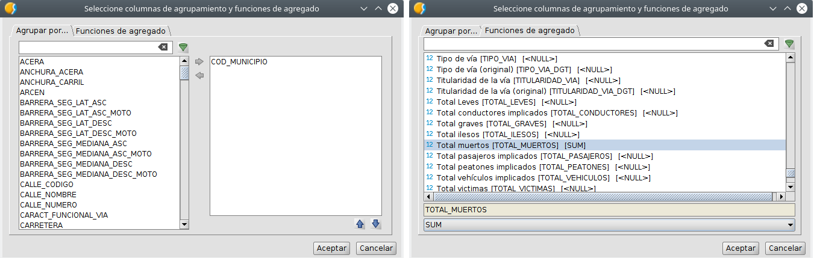
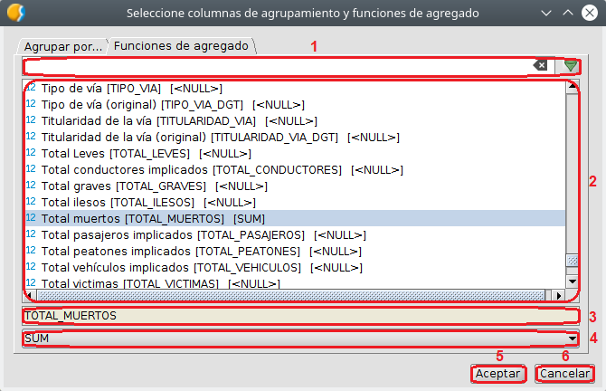
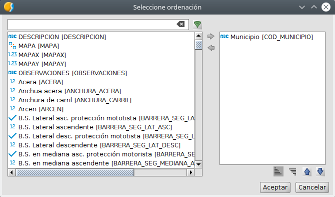
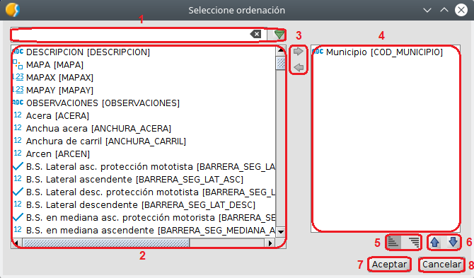

 encoding: utf-8 

 Búsqueda simplificada 

La *ficha de búsqueda simplificada* o básica es la que aparece 
por defecto al iniciar el proceso de consulta de datos. 
Permite la selección del campo o campos en los cuales realizar 
las consultas así como los operadores lógicos necesarios para 
relacionar dichos campos y para definir las búsquedas.

Las partes que componen la *ficha de búsqueda simplificada* son 
las siguientes.

1. Pestaña que indica que la ficha de búsqueda es la 
   simplificada o básica.
2. Campo donde se va a realizar la consulta.
3. Icono que permite realizar la selección de campos en una 
   pestaña independiente.
4. Operador lógico implementado en la consulta.
5. Valor buscado o deseado.
6. Operador lógico utilizado para relacionar búsquedas en otros campos.
7. Icono que permite mostrar la búsqueda en un formulario.
8. Icono que permite exportar la búsqueda en diferentes 
   formatos mediante el *Exportador*.
9. Icono que permite mostrar la búsqueda en un informe.
10. Icono que muestra el historial global de cualquiera ficha de búsqueda sea cual sea.
11. Icono que muestra las búsquedas favoritas de cualquiera ficha de búsqueda sea cual sea.
12. Icono que permite seleccionar herramientas extra dentro de la *ficha de búsqueda*.
13. Zona donde se representan los resultados de la búsqueda con las columnas especificadas.
14. Icono que permite limpiar los parametros de búsqueda.
15. Icono que inicia el proceso de búsqueda simple.
16. Conjunto de iconos que gestionan la acumulación de filtros o consultas. Permite iniciar el proceso de acumulacion de filtros, ver el proceso y eliminar la acumulación. La acumulación de filtros o consultas se realiza mediante el *operador lógico Y*.

Las herramientas extra, icono 12, a utilizar en la ficha de búsqueda simplificada son las siguientes:

* Usar etiquetas.
* Usar nombres.
* Usar etiquetas y nombres.
* Seleccionar columnas a visualizar. Esta herramienta presenta una ventana que permite realizar la acción de manera dinámica.

  
  
  Las partes que componen dicha ventana son las siguientes.
  
  

  1. Barra que nos permite realizar búsqueda de columnas por teclado.
  2. Zona donde se muestran las columnas resultado de la búsqueda con la barra anterior o todas si no hay consulta.
  3. Iconos que permiten llevar columnas de la zona de busqueda a la zona donde se agrupan las que van a ser mostradas. Este icono también permite quitar columnas del grupo a representar.
  4. Zona donde se encuentran las columnas a representar.
  5. Iconos que permiten ordenar las columnas a representar.
  6. Icono que permite aceptar las columnas selecionadas.
  7. Icono que permite cancelar el proceso.

* Columnas calculadas. Esta función extra permite crear columnas nuevas a partir de datos de otras columnas existentes en la base de datos. Esta herramienta presenta una ventana que permite realizar la acción de manera dinámica.

  

  Las partes que componen dicha ventana son las siguientes.

  

  1. Zona donde se muestran las columnas calculadas.
  2. Icono que permite crear una nueva columna calculada.
  3. Icono que permite eliminar una columna calculada.
  4. Iconos que permite ordenar las columnas calculadas.
  5. Zona donde se indica el nombre de la nueva columna calculada.
  6. Zona donde se indica mediante un desplegable el tipo de dato de la columna calculada.
  7. Icono que permite seleccionar el tipo de dato de la columna calculada.
  8. Zona donde se indica la expresión o formula que surtirá de datos a la columna.
  9. Icono que permite llamar al *Creador de expresiones* para crear la expresión.
  10. Icono que muesta el historial de expresiones.
  11. Icono que muestra las expresiones favoritas.
  12. Zona donde se indica el tamaño del dato de la columna calculada.
  13. Zona donde se indica la precisión del dato de la columna calculada.
  14. Zona donde se indica el escalar del dato de la columna calculada.
  15. Icono que permite realizar una creación o configuración avanzada de la columna calculada mediante una nueva ventana gráfica. Dicha ventana gráfica se muestra a continuación.

  
  
  16. Icono que permite aplicar los cambios de esa nueva columna calculada.
  17. Icono que permite acertar y finalizar los procesos asociados a las columnas calculadas.
  18. Icono que cierra la ventana de gestión de columnas calculadas.

* Agrupar por... Esta herramienta permite como su propio nombre indica agrupar por campos. La ventana se estructura en dos pestañas, una de selección de columnas o campos igual a la de *Seleccionar columnas a visualizar* y otra donde se especifica la funcion de agregación. Ambas ventanas se muestran acontinuación.

  

  La primera pestaña como se ha comentado anteriormente permite selecionar la columna o campo por el cual se va a agrupar. La segunda ventana introduce los campos a mostrar información y la función de agregación a aplicar en estos. 
  
  Importante mencionar que se pueden tener diferentes funciones de agregación en cada columna o campo a representar y que los campos sin función de agregación apareceran en blanco.
  
  A continuación se muestra detallada la pestaña *Funciones de agregado*, la segunda pestaña de la herramienta *Agrupar por...*. No se muestra la primera pestaña ya que como se dijo anteriormente esta es igual a *Seleccionar columnas a visualizar*.
 
  

  1. Barra que nos permite realizar búsqueda de columnas/campos por teclado.
  2. Zona donde se muestran las columnas resultado de la búsqueda con la barra anterior o todas si no hay consulta.
  3. Barra donde se muestra la columna o campo seleccionado sobre el cual realizar la agrupación.
  4. Función de agregado o agregación. Actualmente hay implimentadas cuatro; MIN, COUNT, SUM y MAX.
  5. Icono que permite aceptar y terminar el proceso de agrupar, mostrando los resultados en la *ficha de búsqueda*.
  6. Icono que cancela el proceso de agrupar y cierra la ventana.

* Ordenar por... Esta es la última de las herramientas extra de la ficha de búsqueda y como su propio nombre indica permite ordenar columnas segun su valor numérico o alfanumérico de maera descendente o ascendente.

  La ventana de esta herramienta se muestra acontinuación.

  

  Las partes que componen dicha ventana son las siguientes.

  

  1. Barra que nos permite realizar búsqueda de columnas/campos por teclado.
  2. Zona donde se muestran las columnas resultado de la búsqueda con la barra anterior o todas si no hay consulta.
  3. Iconos que permiten llevar columnas de la zona de busqueda a la zona donde se agrupan las que van a ser ordenadas. Este icono también permite quitar columnas del grupo a ordenar.
  4. Zona donde se encuentran las columnas propuestas a ser ordenadas.
  5. Iconos que permiten seleccionar un orden ascendente o descendente.
  6. Iconos que permiten ordenar las columnas a ordenar en la zona donde se agrupan.
  7. Icono que permite aceptar y terminar el proceso.
  8. Icono que cancela el proceso y cierra la ventana.

Tras exponer las diferentes partes , funciones y herramientas que presenta la *ficha de búsqueda simple*, a continuación se muestra un breve ejemplo. El proceso de búsqueda es "simple" y consiste en la selección del campo 
a realizar la consulta, el operador lógico a aplicar y el valor deseado.

