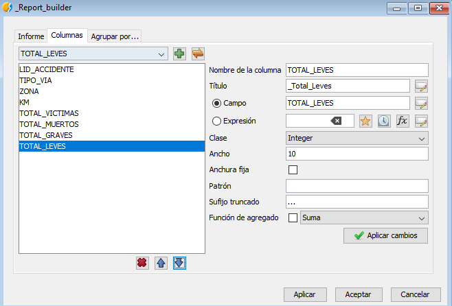

 encoding: utf-8 

 Informes definidos por el usuario 

A la hora de generar informes, como por ejemplo, desde la 
herramienta de búsqueda, existe la posibilidad de crear informes que 
se pueden definir en tiempo de ejecución por parte del usuario. Esta 
herramienta se puede utilizar para realizar informes sobre resultados 
cuando no tenemos una plantilla personalizada preparada.

En este caso en la ficha de búsqueda seleccionamos el informe 
definido por el usuario.

En la pantalla que aparece principal se puede configurar las opciones 
principales de representación del informe como título, subtítulo, formato, etc.

En la siguiente pestaña, se pueden configurar los campos que se desean que aparezcan, con una configuración específica para cada campo. Los campos deseados se seleccionan en el desplegable y se añaden con el botón que aparece a su lado. De esta forma, se añaden varios campos como aparece en la imagen.

Hay diferentes opciones que permiten otras configuraciones de estilo, como por ejemplo, el título.

Al presionar aceptar se mostraría el siguiente informe dentro de la aplicación de gvSIG. Este informe se podría consultar aquí directamente, exportarlo a PDF o ser impreso.

